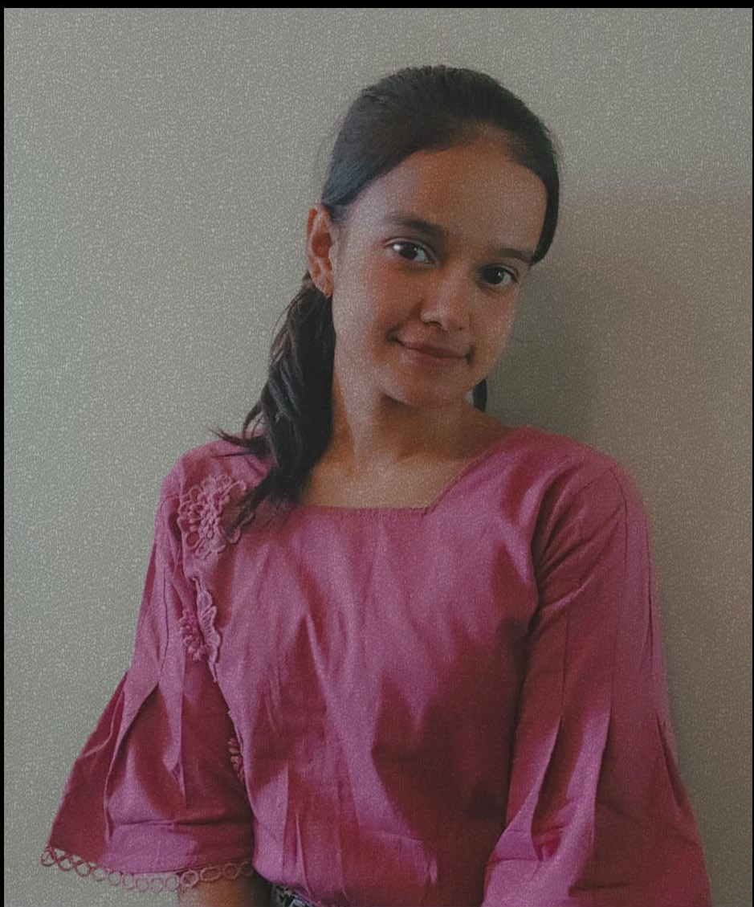

# 💻 Tanya Varshney | Portfolio Website

Welcome to my personal portfolio website!  
I’m Tanya Varshney — a **BCA student** currently learning and building projects in **Web Development**.  
This website showcases my **skills, projects, certificates**, and how to connect with me.

---

## 🚀 What’s Inside?

🔹 **Home** – A short intro about me  
🔹 **Skills** – Tech stack I'm learning and using  
🔹 **Projects** – Real projects with live demo links  
🔹 **Certificates** – Achievements and online course proofs  
🔹 **Contact** – My GitHub, LinkedIn, Instagram, and Email  

---

## 🌐 Live Portfolio Link

🔗 [Visit my portfolio](https://Tanyav-rshney.github.io/portfolio/)  

---

## 📷 Screenshot

---

## 🛠️ Tech Stack

- HTML
- CSS
- JavaScript
- GitHub Pages
- Netlify (for future use)
- Light/Dark Mode Toggle

---

## 📫 Connect with Me

- [GitHub](https://github.com/Tanyav-rshney)
- [LinkedIn](https://www.linkedin.com/in/tanya-varshney-069839348/)
- [Instagram](https://www.instagram.com/tanyav_rshney102/)
- Email: tv728879@gmail.com

---

### 💖 Thanks for visiting!

